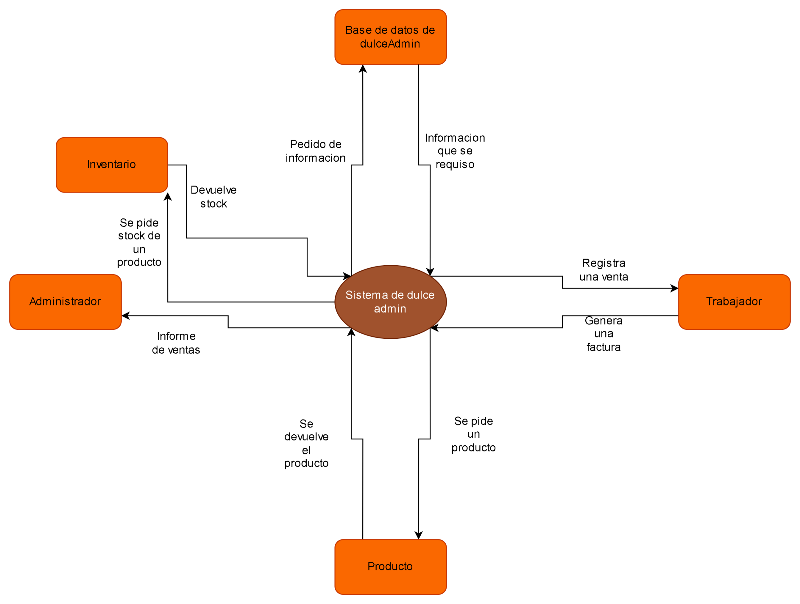

## 4. Modelo de Contexto

El modelo de contexto de **DulceAdmin** describe los límites del sistema y sus interacciones con los actores externos.  
Este modelo permite comprender el alcance funcional del software, los flujos de información y las dependencias clave con el entorno operativo de la panadería.

### 4.1 Actores Externos
- **Administrador:** usuario con privilegios completos; puede registrar productos, gestionar inventario, anular facturas y consultar reportes.  
- **Trabajador / Mesero:** usuario operativo encargado de registrar ventas, generar facturas y consultar disponibilidad de productos.  
- **Cliente:** actor indirecto que recibe el servicio; no interactúa directamente con el sistema.  
 

### 4.2 Entorno del Sistema
El sistema se encuentra instalado localmente en los equipos de la panadería, operando bajo una red LAN.  
En caso de pérdida de conexión a internet, **DulceAdmin** continúa funcionando en modo offline, permitiendo registrar ventas e inventario.  
Al restablecer la conexión, se ejecuta un proceso automático de sincronización con la base de datos central.

### 4.3 Flujo de Interacción
El trabajador registra una venta lo cual devolvera una factura
Se consulta algo a la base de datos, la base de datos devolvera la informacion o el dato requerido
Se requiere un producto para hacer la venta, se devolvera el producto con su precio
Se consulta si el producto esta disponible en inventario para la venta se devolvera el producto o la alerta sobre el producto
El adminisrador pedira el reporte de ventas

### 4.4 Dependencias Externas
- **Base de datos PostgreSQL:** almacena toda la información del negocio.  
- **Sistema dulceAdmin:** interfaz web que facilita la interacción del usuario con el sistema.  

En resumen, el modelo de contexto define a **DulceAdmin** como un sistema **autónomo, localmente operativo y extensible**, que interactúa con usuarios internos y puede integrarse progresivamente con servicios externos a medida que evolucione hacia una arquitectura distribuida o basada en la nube.

---

[ir al inicio](/README.md).

[Ir al anterior](3.Tacticas_y_Estrategias.md).

[5. Arquetipo](5.Arquetipo_Solucion_Referencia.md).