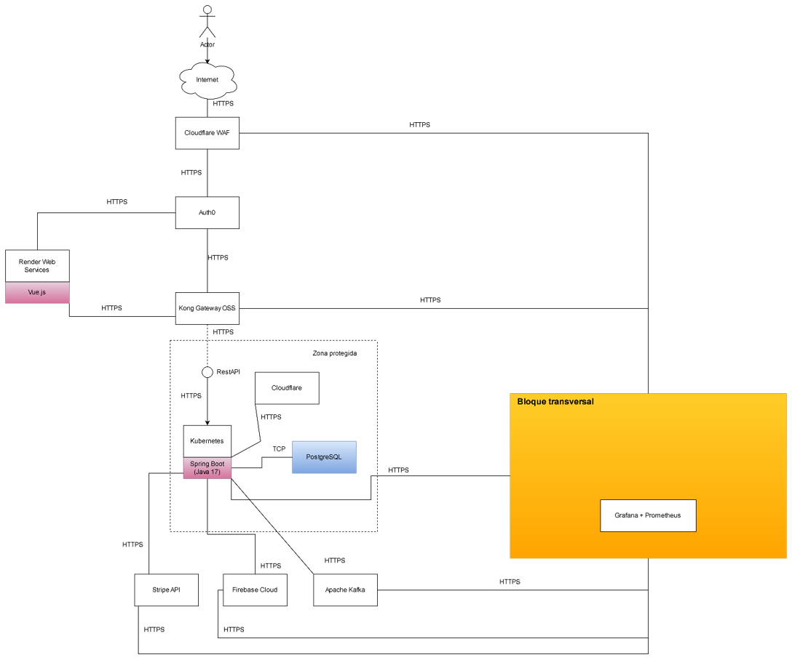

## 5. Arquetipo de Solución / Referencia

El **arquetipo de solución** representa un modelo conceptual o plantilla arquitectónica que define la **estructura general y las relaciones entre los componentes del sistema** desde un punto de vista agnóstico a las tecnologías.  
Es decir, describe **cómo se organiza la solución a nivel de capas, responsabilidades y comunicación**, sin depender de frameworks o herramientas específicas.  
Su propósito es **guiar el diseño y evolución del sistema** de manera coherente, asegurando que todos los componentes cumplan con principios de mantenibilidad, escalabilidad y reutilización.

El arquetipo de solución de **DulceAdmin** se basa en los principios de **Clean Architecture** y **arquitectura en capas**, promoviendo el bajo acoplamiento y la alta cohesión.  
A continuación, se presentan los componentes principales que conforman este arquetipo, junto con su intención y motivación:

| Componente | Intención / Motivación | Uso / Adopción |
|-------------|------------------------|----------------|
| **Capa de Presentación (Interfaces de Usuario)** | Facilitar la interacción del usuario con el sistema a través de una interfaz gráfica clara y responsiva. | Permite a los trabajadores y administradores registrar ventas, consultar inventario y generar reportes. |
| **Capa de Aplicación (Casos de uso)** | Contener la lógica que coordina las operaciones del negocio sin depender de frameworks ni bases de datos. | Define los flujos de trabajo (registrar venta, generar recibo, actualizar inventario). |
| **Capa de Dominio (Entidades de Negocio)** | Representar las reglas de negocio puras y modelos fundamentales del sistema. | Incluye entidades como *Producto*, *Recibo*, *Trabajador*, *Cliente* y sus relaciones. |
| **Capa de Infraestructura (Adaptadores y Persistencia)** | Encapsular la comunicación con recursos externos como bases de datos o APIs. | Contiene los repositorios, mapeos y controladores de acceso a PostgreSQL. |
| **Capa de Cross-Cutting (Servicios Transversales)** | Manejar aspectos comunes como validaciones, excepciones, logs y seguridad. | Proporciona soporte transversal sin afectar la lógica central. |
| **Bus de Comunicación / Dependencia Invertida** | Facilitar la conexión entre capas mediante interfaces y principios de inyección de dependencias. | Permite que las capas superiores dependan de abstracciones, no de implementaciones concretas. |

El arquetipo establece la estructura base sobre la que se construye **DulceAdmin**, asegurando una separación clara entre las reglas del negocio y los mecanismos técnicos que las soportan.

