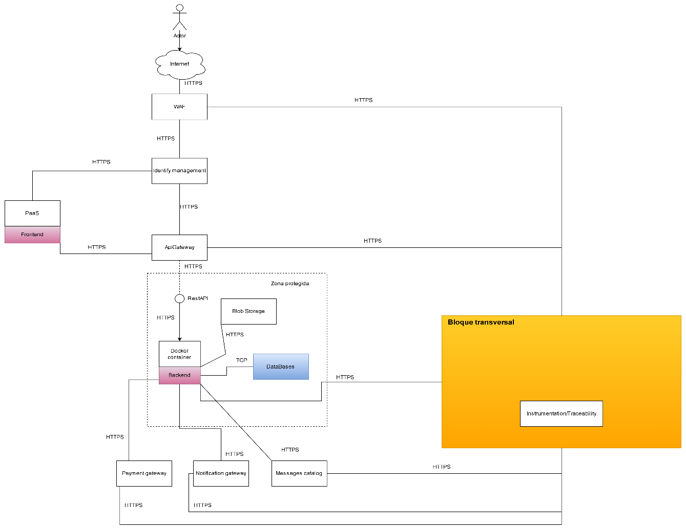

## 6. Arquitectura de Solución / Referencia

La **arquitectura de solución** describe cómo se concreta el arquetipo conceptual en una **implementación real con tecnologías y componentes específicos**.  
Su objetivo es mostrar **cómo se materializan las decisiones arquitectónicas** adoptadas en el proyecto *DulceAdmin*, incluyendo frameworks, librerías, servicios, herramientas y sus interacciones dentro del entorno de ejecución.

En esta arquitectura, los componentes se implementan siguiendo los lineamientos definidos en el arquetipo, pero con asignación concreta de tecnologías y responsabilidades.  
A continuación, se detalla la arquitectura de referencia empleada:

| Componente Concreto | Intención / Función | Justificación / Uso |
|----------------------|---------------------|----------------------|
| **Frontend (Vue.js)** | Interfaz visual e interactiva del sistema. | Vue.js permite desarrollar interfaces reactivas, modulares y mantenibles, con excelente rendimiento en entornos locales o web. |
| **Backend (Spring Boot – Java)** | Implementa la lógica de negocio, controladores y servicios. | Spring Boot facilita la creación de aplicaciones robustas y escalables, integrando seguridad, persistencia y REST APIs. |
| **Base de Datos (PostgreSQL)** | Almacenamiento estructurado de la información. | PostgreSQL garantiza consistencia, transacciones seguras y compatibilidad con frameworks Java mediante Spring Data JPA. |
| **Módulo de Sincronización Local** | Maneja la operación offline y sincronización con la base de datos principal. | Permite continuidad de operaciones sin conexión, asegurando integridad de datos al reconectarse. |
| **Módulo de Seguridad y Control de Acceso** | Autenticación y gestión de roles (mesero, administrador, contador). | Protege el acceso a funciones críticas mediante control de permisos y cierre automático de sesión. |
| **Módulo de Ventas y Facturación** | Gestión de transacciones, generación de recibos y registro de ventas. | Constituye el núcleo operativo del sistema, garantizando fluidez y precisión en el proceso de venta. |
| **Módulo de Inventario** | Administración del stock de productos, registro y actualización de existencias. | Permite control de inventario en tiempo real, reduciendo errores y pérdidas operativas. |
| **Módulo de Reportes** | Generación de reportes de ventas, inventario y desempeño. | Ofrece información consolidada para la toma de decisiones, optimizando el control administrativo. |
| **Sistema Operativo y Red LAN** | Entorno de ejecución local. | Permite funcionamiento offline y comunicación interna rápida entre dispositivos. |

Esta arquitectura está diseñada para ser **flexible, escalable y mantenible**, permitiendo futuras integraciones con servicios en la nube, aplicaciones móviles o sistemas de terceros.

---

### Resumen Comparativo

| Aspecto | Arquetipo de Solución | Arquitectura de Solución |
|----------|-----------------------|---------------------------|
| **Naturaleza** | Conceptual y agnóstica a tecnologías. | Concreta y dependiente de herramientas específicas. |
| **Enfoque** | Define el *qué* y el *cómo general*. | Define el *con qué* y *dónde se implementa*. |
| **Propósito** | Guiar la estructura lógica del sistema. | Describir la implementación tecnológica y sus componentes reales. |
| **Ejemplo en DulceAdmin** | Basado en Clean Architecture con capas desacopladas. | Implementado con Vue.js, Spring Boot y PostgreSQL. |

