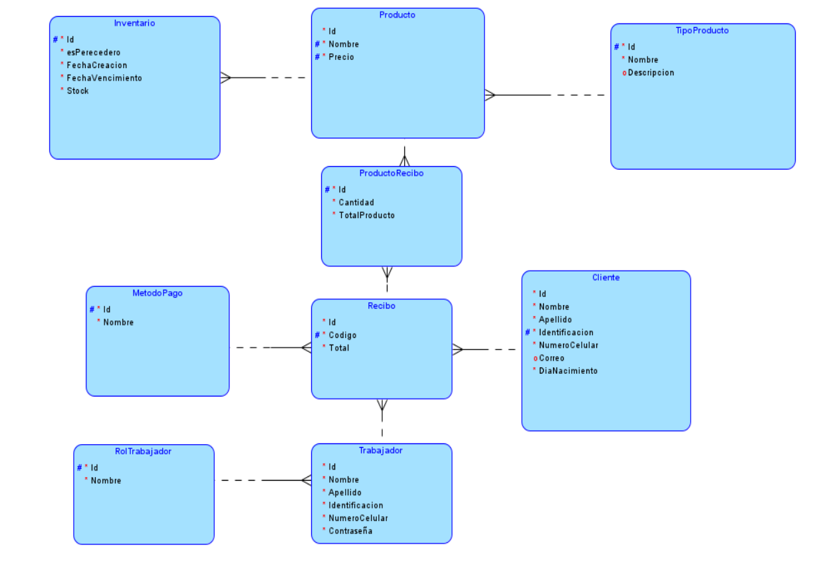
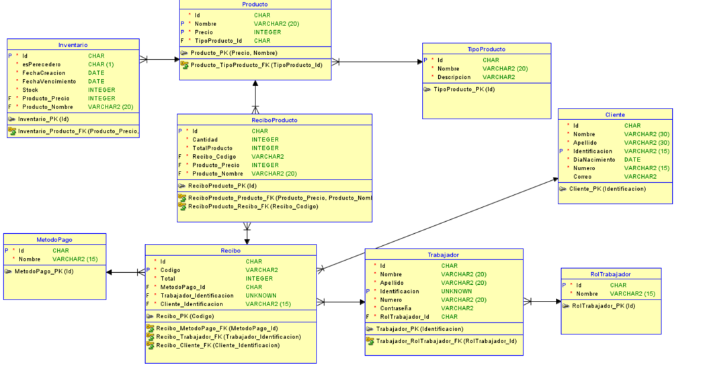

## Modelo Entidad–Relación (MER) – DulceAdmin

### Descripción General

El **Modelo Entidad–Relación (MER)** describe la estructura de la base de datos del sistema **DulceAdmin**.  
Permite visualizar las entidades principales, sus atributos, claves primarias y foráneas, así como las relaciones existentes entre ellas.  
Este modelo fue diseñado para implementarse en **PostgreSQL**.

---

### Entidades Principales

| Entidad | Descripción | Atributos Relevantes |
|----------|--------------|----------------------|
| **Producto** | Contiene la información de los productos a la venta. | `id`, `nombre`, `precio`, `tipoProducto_id` |
| **TipoProducto** | Clasifica los productos según su categoría. | `id`, `nombre`, `descripcion` |
| **Inventario** | Controla la cantidad disponible y fechas de vencimiento. | `id`, `esPerecedero`, `fechaCreacion`, `fechaVencimiento`, `stock`, `producto_id` |
| **Recibo** | Registra las transacciones de venta. | `id`, `codigo`, `total`, `cliente_id`, `trabajador_id`, `metodoPago_id` |
| **ReciboProducto** | Asocia los productos con el recibo correspondiente. | `id`, `cantidad`, `totalProducto`, `recibo_id`, `producto_id` |
| **Cliente** | Contiene los datos personales de los clientes. | `id`, `nombre`, `apellido`, `identificacion`, `correo`, `numeroCelular`, `diaNacimiento` |
| **Trabajador** | Registra los empleados del sistema. | `id`, `nombre`, `apellido`, `identificacion`, `numeroCelular`, `contraseña`, `rolTrabajador_id` |
| **RolTrabajador** | Define el rol del trabajador dentro del sistema. | `id`, `nombre` |
| **MetodoPago** | Registra los tipos de pago disponibles. | `id`, `nombre` |

---

### Relaciones Principales

- **Producto** pertenece a un **TipoProducto** *(1:N)*.  
- **Inventario** se asocia a un **Producto** *(1:1)*.  
- **ReciboProducto** conecta **Recibo** con **Producto** *(N:M)*.  
- **Recibo** pertenece a un **Cliente** *(N:1)* y a un **Trabajador** *(N:1)*.  
- **Recibo** tiene un **Método de Pago** *(N:1)*.  
- **Trabajador** tiene un **RolTrabajador** *(N:1)*.  

---

### Diagramas del MER

---

### Integridad Referencial

- Todas las claves foráneas están correctamente definidas para garantizar la integridad entre entidades.  
- El modelo asegura que no existan registros huérfanos (por ejemplo, un *ReciboProducto* siempre pertenece a un *Recibo* y a un *Producto* existente).  
- Se cumple el principio de **normalización** hasta la **Tercera Forma Normal (3FN)**, evitando redundancias y asegurando consistencia.

---

### Conclusión

El **Modelo Entidad–Relación** es la base estructural de la persistencia del sistema DulceAdmin.  
Define de manera clara la organización de los datos y sus relaciones, permitiendo una gestión eficiente del inventario, clientes, trabajadores y ventas dentro del sistema.

[ir al inicio](/README.md).

[Ir al anterior](8.Justificacion_LineaBase.md).

[Modelo de actividades](Modelo_Actividades.md).