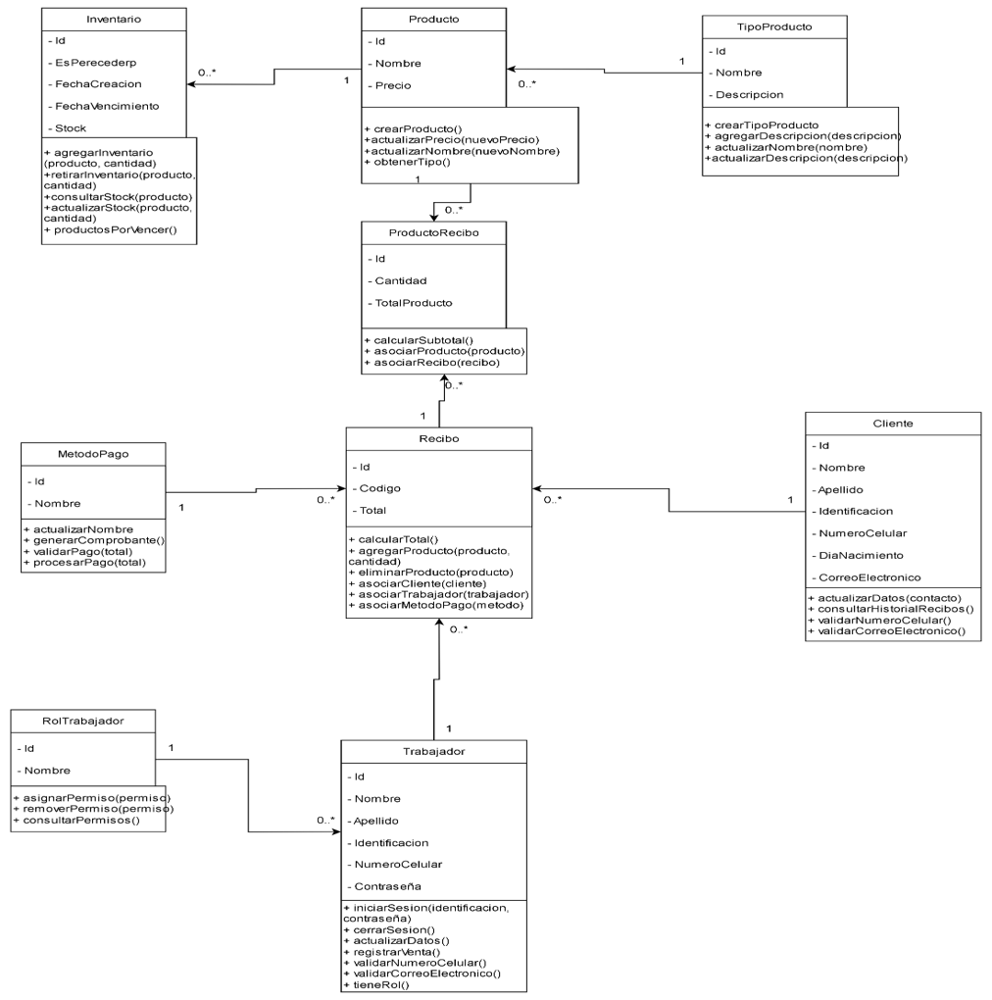

## Modelo de Clases – DulceAdmin

### Descripción General

El **modelo de clases** representa la estructura estática del sistema **DulceAdmin**, mostrando las clases principales, sus atributos, métodos y relaciones.  
Este modelo sirve como base para la implementación en Java (Spring Boot) y define las reglas de interacción entre los distintos componentes del sistema.

---

### Clases Principales

| Clase | Descripción | Atributos Relevantes | Métodos Principales |
|--------|--------------|----------------------|----------------------|
| **Producto** | Representa los productos disponibles para la venta. | `nombre`, `precio`, `tipo` | `crearProducto()`, `actualizarPrecio()`, `actualizarNombre()`, `obtenerTipo()` |
| **TipoProducto** | Clasifica los productos según su categoría. | `nombre`, `descripcion` | `crearTipoProducto()`, `actualizarDescripcion()` |
| **Inventario** | Controla la cantidad disponible de productos y su vigencia. | `esPerecedero`, `fechaCreacion`, `fechaVencimiento`, `stock` | `agregarInventario()`, `consultarStock()`, `productosPorVencer()` |
| **Recibo** | Representa la factura generada por cada venta. | `codigo`, `total`, `cliente`, `trabajador`, `metodoPago` | `calcularTotal()`, `agregarProducto()`, `eliminarProducto()`, `asociarCliente()` |
| **ReciboProducto** | Asocia productos a un recibo específico. | `cantidad`, `totalProducto` | `calcularSubtotal()`, `asociarProducto()`, `asociarRecibo()` |
| **Cliente** | Contiene los datos del comprador. | `nombre`, `apellido`, `identificacion`, `correo`, `numeroCelular` | `actualizarDatos()`, `consultarHistorialRecibos()` |
| **Trabajador** | Usuario interno que gestiona las ventas. | `nombre`, `apellido`, `identificacion`, `rol`, `contraseña` | `iniciarSesion()`, `registrarVenta()`, `cerrarSesion()` |
| **RolTrabajador** | Define los permisos y funciones de cada trabajador. | `nombre` | `asignarPermiso()`, `consultarPermisos()` |
| **MetodoPago** | Indica la forma de pago utilizada en una venta. | `nombre` | `procesarPago()`, `validarPago()` |

---

### Relaciones entre Clases

- **Producto** pertenece a un **TipoProducto**.  
- **Inventario** gestiona la cantidad y vencimiento de cada **Producto**.  
- **ReciboProducto** asocia uno o más **Productos** a un **Recibo**.  
- **Recibo** está vinculado a un **Cliente**, un **Trabajador** y un **Método de Pago**.  
- **Trabajador** tiene un **RolTrabajador** que define sus permisos.  

---

### Diagrama del Modelo de Clases

---

### Conclusión

El **modelo de clases** define la estructura lógica y orientada a objetos del sistema DulceAdmin.  
Permite comprender cómo se relacionan las entidades del dominio de negocio y sienta las bases para la implementación del sistema en Java mediante el patrón de diseño en capas.

[ir al inicio](/README.md).

[Ir al anterior](Modelo_Actividades.md).

[Modelo de componentes](Modelo_Componentes.md).