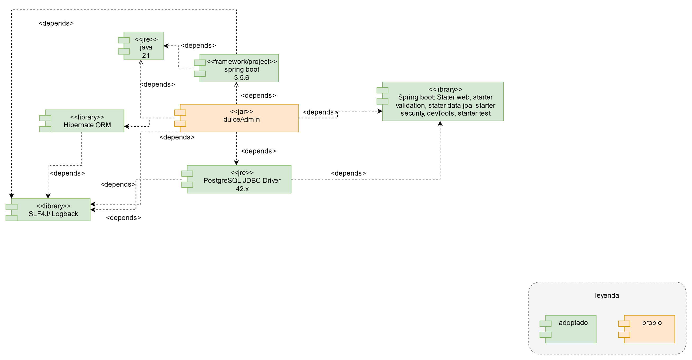

## Modelo de Componentes – Backend DulceAdmin

### Descripción general
El **modelo de componentes** representa las dependencias técnicas utilizadas en el backend de *DulceAdmin*.  
Este modelo permite visualizar cómo el proyecto integra librerías externas, frameworks y APIs para cumplir los requerimientos de negocio.

---

### Componentes
| Tipo | Nombre del componente | Descripción | Rol |
|------|------------------------|-------------|-----|
| **Propio** | `dulceadmin-backend (dulceadmin.jar)` | Núcleo del sistema. Implementa la lógica de negocio, controladores REST, validaciones y transacciones. | Aplicación principal |
| **Adoptado** | `Java 21` | Lenguaje de programación base, multiplataforma y robusto. | Entorno de ejecución |
| **Adoptado** | `Spring Boot 3.5.6` | Framework para desarrollo rápido de aplicaciones web y REST. | Framework base |
| **Adoptado** | `Spring Boot Starter Web` | Permite construir controladores REST y manejar peticiones HTTP. | Librería |
| **Adoptado** | `Spring Boot Starter Data JPA` | Facilita el acceso a bases de datos con Hibernate y JPA. | Librería de persistencia |
| **Adoptado** | `Spring Boot Starter Validation` | Gestiona validaciones de datos mediante anotaciones (Bean Validation). | Librería de validación |
| **Adoptado** | `Spring Boot Starter Security` | Provee mecanismos de autenticación y autorización. | Librería de seguridad |
| **Adoptado** | `Spring Boot DevTools` | Permite recarga automática en desarrollo. | Herramienta de desarrollo |
| **Adoptado** | `Spring Boot Starter Test` | Proporciona utilidades de pruebas unitarias e integración. | Librería de testing |
| **Adoptado** | `PostgreSQL JDBC Driver 42.x` | Controlador JDBC para conexión con PostgreSQL. | Driver de base de datos |
| **Adoptado** | `Hibernate ORM` | Framework de mapeo objeto-relacional compatible con JPA. | ORM |
| **Adoptado** | `Jakarta Persistence API (JPA)` | Estándar para la gestión de entidades y persistencia de datos. | API de persistencia |
| **Adoptado** | `Lombok` | Reduce el código repetitivo (getters, setters, constructores). | Utilidad |
| **Adoptado** | `ModelMapper` | Facilita la conversión entre entidades, DTOs y dominios. | Utilidad |
| **Adoptado** | `Apache Commons Lang3` | Proporciona utilidades para manejo de cadenas, fechas y números. | Utilidad |
| **Adoptado** | `SLF4J / Logback` | Librerías para registro de logs y depuración. | Logging |
| **Adoptado** | `JUnit 5` | Framework de pruebas unitarias. | Testing |
| **Adoptado** | `Mockito` | Simula dependencias para pruebas unitarias. | Mocking |

---

### Intención y motivación
- Asegurar **modularidad** y **mantenibilidad** mediante la adopción de dependencias especializadas.  
- Garantizar **seguridad, trazabilidad y validación** dentro del ciclo de vida de la aplicación.  
- Mejorar la **productividad del desarrollo** gracias al ecosistema de Spring Boot y herramientas complementarias.  
- Promover la **escalabilidad y portabilidad** del sistema con tecnologías estables y open source.

---

### Diagrama de referencia

---

### Conclusión
Este modelo define la **línea base técnica** del backend *DulceAdmin*, consolidando las dependencias que garantizan su correcto funcionamiento y mantenimiento a largo plazo.  
La clara separación entre **componentes propios y adoptados** facilita la trazabilidad de versiones, el control de compatibilidad y la evolución del sistema.