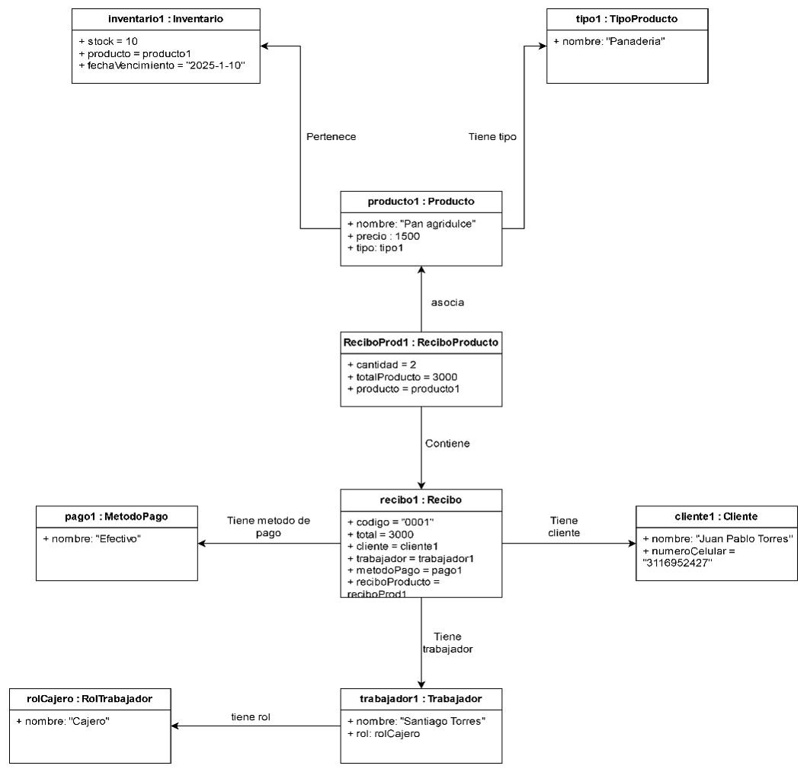

##  Modelo de Objetos – DulceAdmin

### Descripción General

El **modelo de objetos** muestra instancias concretas de las clases del sistema **DulceAdmin** en un escenario real.  
Este modelo permite visualizar cómo se relacionan los objetos durante una venta específica, mostrando valores reales que representan un caso práctico del sistema.

---

### Escenario

Un trabajador llamado **Santiago Torres** (rol *Cajero*) atiende a un cliente **Juan Pablo Torres**, quien compra 2 unidades de *Pan agridulce*.  
El pago se realiza en efectivo, y el sistema genera el recibo correspondiente.

---

### Objetos Involucrados

| Clase | Objeto | Atributos relevantes |
|--------|---------|----------------------|
| **Inventario** | `inventario1` | stock = 10, producto = producto1 |
| **Producto** | `producto1` | nombre = "Pan agridulce", precio = 1500, tipo = tipo1 |
| **TipoProducto** | `tipo1` | nombre = "Panadería" |
| **ReciboProducto** | `reciboProd1` | cantidad = 2, totalProducto = 3000, producto = producto1 |
| **Recibo** | `recibo1` | código = "0001", total = 3000, cliente = cliente1, trabajador = trabajador1, métodoPago = pago1, reciboProducto = reciboProd1 |
| **Cliente** | `cliente1` | nombre = "Juan Pablo Torres", númeroCelular = "3116952427" |
| **RolTrabajador** | `rolCajero` | nombre = "Cajero" |
| **Trabajador** | `trabajador1` | nombre = "Santiago Torres", rol = rolCajero |
| **MétodoPago** | `pago1` | nombre = "Efectivo" |

---

### Relaciones entre Objetos

- `recibo1` asocia a `trabajador1`, `cliente1` y `pago1`.  
- `recibo1` contiene a `reciboProd1`, el cual relaciona el producto comprado.  
- `producto1` pertenece al tipo `tipo1` y está incluido en el `inventario1`.  
- `trabajador1` posee el rol `rolCajero`.

---

### Diagrama del Modelo de Objetos

---

### Conclusión

El **modelo de objetos** representa un caso real de interacción entre las entidades del sistema durante una venta.  
Facilita la comprensión de cómo los objetos colaboran para generar un recibo, registrar el pago y actualizar el inventario.
