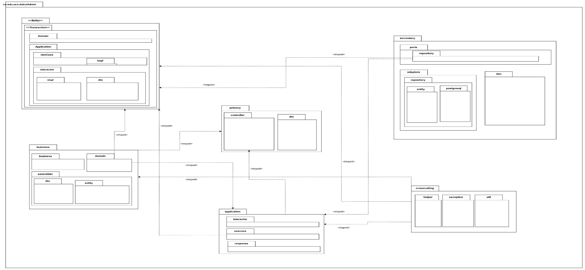

# Modelo de Paquetes – DulceAdmin

## 1. Descripción General

El modelo de paquetes del sistema **DulceAdmin** representa la organización modular del backend bajo los principios de **Clean Architecture** y **Domain-Driven Design (DDD)**.  
Cada paquete agrupa clases y componentes con responsabilidades específicas, asegurando **alta cohesión** interna y **bajo acoplamiento** entre capas.

Esta estructura facilita la mantenibilidad, escalabilidad y extensibilidad del sistema, permitiendo incorporar nuevas funcionalidades o reemplazar dependencias sin afectar el resto de la arquitectura.

---

## 2. Propósito del Modelo

El propósito del modelo de paquetes es:

- Representar de forma visual y estructural la organización del código fuente.
- Definir las dependencias entre las capas del sistema (`<import>`).
- Garantizar la separación clara entre los niveles **de dominio**, **aplicación**, **infraestructura** y **presentación**.
- Favorecer la aplicación de los principios **SOLID** y **Clean Code**.

---

## 3. Relaciones entre Paquetes

| Origen | Destino | Tipo de relación | Descripción |
|--------|----------|------------------|--------------|
| `primary.controller` | `application.usecase` | `<import>` | Los controladores invocan los casos de uso. |
| `application.usecase` | `business.domain` | `<import>` | Los casos de uso acceden a las entidades del dominio. |
| `application` | `secondary.ports.repository` | `<import>` | La capa de aplicación define las interfaces de acceso a datos. |
| `secondary.adapters.repository` | `secondary.ports.repository` | `<import>` | Implementan los repositorios definidos en los puertos. |
| `crosscutting.helper` | *todas las capas* | `<import>` | Provee utilidades y validaciones comunes. |
| `crosscutting.exception` | *todas las capas* | `<import>` | Permite el manejo centralizado de errores. |

---

## 4. Descripción de los Paquetes Principales

### `application`
Encapsula la lógica de aplicación y los casos de uso. Orquesta la interacción entre controladores, dominio y persistencia.

**Subpaquetes:**
- `usecase`: define interfaces y lógica de negocio aplicada.  
- `interactor`: coordina la ejecución de casos de uso.  
- `response`: maneja la salida estandarizada hacia los controladores.

---

### `business`
Define la capa central del dominio del negocio, incluyendo entidades, validaciones y ensambladores.

**Subpaquetes:**
- `domain`: contiene los modelos de negocio (`ClienteDomain`, `ProductoDomain`, `InventarioDomain`, etc.).
- `assembler`: transforma objetos entre capas (`DTO ↔ Domain ↔ Entity`).

---

### `crosscutting`
Contiene clases utilitarias, excepciones y helpers que son reutilizables a lo largo de todo el sistema.

**Subpaquetes:**
- `helper`: clases de apoyo (`UUIDHelper`, `TextHelper`, `DateHelper`, etc.).  
- `exception`: define excepciones personalizadas (`DulceAdminException`).  
- `util`: funciones genéricas de apoyo.

---

### `primary`
Representa la capa de entrada o presentación del sistema (API REST).

**Subpaquetes:**
- `controller`: expone endpoints a través de `@RestController`.  
- `dto`: define objetos de transferencia de datos usados por los controladores.

---

### `secondary`
Capa de persistencia y comunicación con recursos externos (PostgreSQL, otros servicios).

**Subpaquetes:**
- `ports.repository`: interfaces de acceso a datos (*puertos*).  
- `adapters.repository.entity`: entidades que representan tablas en BD.  
- `adapters.repository.postgresql`: implementaciones específicas del motor.  
- `dao`: objetos de acceso directo a datos.

---

[ir al inicio](/README.md).

[Ir al anterior](Modelo_Objetos.md).

[Modelo de secuencia](Modelo_secuencia.md).