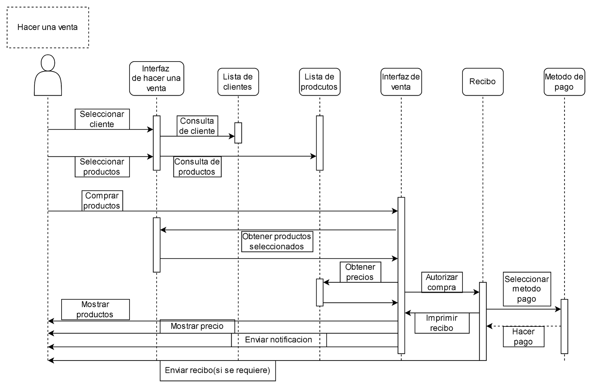

## Modelo de Secuencia

### Descripción general
El **modelo de secuencia** representa el flujo dinámico de interacción entre los actores y los diferentes componentes del sistema durante la ejecución de un caso de uso específico.  
En este caso, se documenta el proceso **“Hacer una venta”**, que corresponde a una de las operaciones principales del sistema **DulceAdmin**.

El propósito de este modelo es describir la **colaboración temporal** entre los elementos del sistema (interfaces, listas, recibos y métodos de pago) para completar exitosamente una venta, desde la selección del cliente hasta la generación del comprobante final.

---

### Elementos involucrados
| Elemento | Descripción |
|-----------|-------------|
| **Actor: Usuario (Cajero)** | Inicia el proceso de venta a través de la interfaz principal. |
| **Interfaz de hacer una venta** | Permite al usuario registrar la venta, consultar productos y seleccionar cliente. |
| **Lista de clientes** | Muestra los clientes disponibles y permite seleccionar al comprador. |
| **Lista de productos** | Presenta los productos disponibles en inventario y sus precios. |
| **Interfaz de venta** | Calcula totales, impuestos y gestiona los pasos de confirmación. |
| **Recibo** | Genera el comprobante de venta con los detalles de la transacción. |
| **Método de pago** | Permite registrar el pago correspondiente (efectivo, tarjeta, etc.). |

---

### Flujo del proceso
1. **El usuario** selecciona la opción *“Hacer una venta”* en el sistema.  
2. El sistema despliega la **Interfaz de hacer una venta**, donde el usuario inicia la operación.  
3. La interfaz consulta la **Lista de clientes** para mostrar las opciones disponibles.  
4. El usuario selecciona un cliente; la interfaz actualiza los datos del comprador.  
5. La interfaz solicita la **Lista de productos** y muestra los artículos disponibles.  
6. El usuario selecciona los productos que desea vender.  
7. La **Interfaz de venta** calcula el subtotal, aplica descuentos o impuestos y prepara el total.  
8. El sistema genera un **Recibo** provisional con la información de la venta.  
9. Se solicita el **Método de pago** elegido por el cliente.  
10. Una vez confirmado el pago, el sistema **finaliza la venta** y emite el **recibo definitivo**.  
11. El usuario visualiza la confirmación y el recibo, dando por concluido el proceso.

---

### Intención y motivación
Este flujo garantiza una **experiencia fluida y ordenada** para el usuario, centralizando todas las interacciones en una única interfaz coherente.  
Además, permite:
- Validar de manera progresiva cada etapa (cliente, producto, pago).  
- Mantener la **integridad de los datos de inventario y ventas**.  
- Integrar de forma transparente el módulo de **pagos** y la **generación de recibos**.  
- Asegurar la trazabilidad completa de la transacción desde su inicio hasta la confirmación final.

---

### Diagrama

> **Figura:** Diagrama de secuencia del caso de uso *Hacer una venta*, mostrando las interacciones entre el usuario, las interfaces y los módulos del sistema.